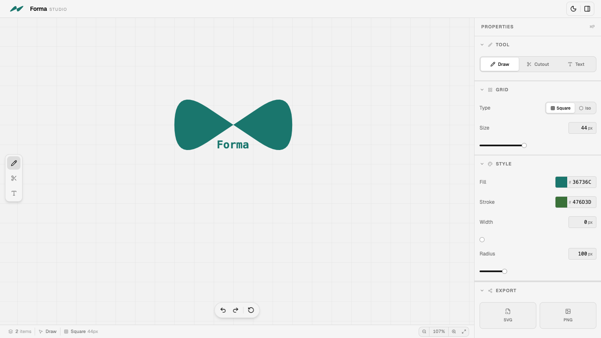

# Forma Studio

A modern, web-based vector design studio built with React and TypeScript. Create, edit, and export vector graphics with an intuitive interface and powerful design tools.



## Features

- **Drawing Tools** - Draw freehand shapes, cut/subtract paths, and add text
- **Grid System** - Snap to grid for precise alignment and design consistency
- **Rich Styling** - Customize fill colors, stroke styles, width, and border radius
- **SVG & PNG Export** - Export your designs in multiple formats
- **History Management** - Undo/redo support for non-destructive editing
- **Responsive UI** - Beautiful, intuitive interface with light/dark mode support
- **Keyboard Shortcuts** - Quick access to tools and common actions
- **Sidebar Properties** - Real-time property editing with live preview

## Getting Started

### Prerequisites

- Node.js 18+
- npm or yarn

### Installation

1. Clone the repository:

```bash
git clone <repository-url>
cd gridmark
```

2. Install dependencies:

```bash
npm install
```

3. Start the development server:

```bash
npm run dev
```

The app will be available at `http://localhost:5173`

## Available Scripts

- `npm run dev` - Start development server
- `npm run build` - Build for production
- `npm run lint` - Run ESLint
- `npm run preview` - Preview production build

## Tech Stack

- **Frontend Framework** - React 19 with TypeScript
- **Styling** - Tailwind CSS 4 with custom animations
- **Build Tool** - Vite
- **UI Components** - Base UI, Radix UI, Shadcn
- **State Management** - Zustand
- **Vector Operations** - Polygon Clipping
- **Icons** - Lucide React
- **Color Picker** - React Colorful
- **Charting** - Recharts
- **Notifications** - Sonner

## Project Structure

```
src/
├── components/
│   ├── canvas/       # Drawing canvas and overlay
│   ├── toolbar/      # Top bar, tools, and history
│   └── sidebar/      # Properties and settings panel
├── hooks/            # Custom React hooks
├── App.tsx           # Main app component
└── main.tsx          # Entry point
```

## Development

This project uses:

- **TypeScript** for type safety
- **ESLint** for code quality
- **Tailwind CSS** for responsive styling
- **Vite** for fast development and builds

## Contributing

Contributions are welcome! Please feel free to submit a Pull Request.


---

Built with ❤️ by Sandeep Singh
